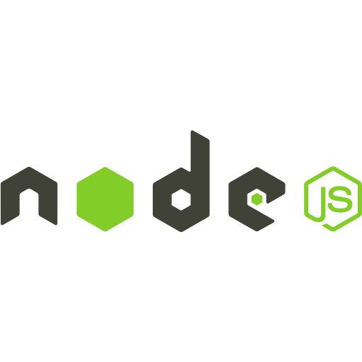

# Hi there, I'm Ashish 👋

## Just another Developer

- 💻 I'm Machine Learning & Artificial Intelligence Enthusiast
- 🌱 I’m currently learning everything 🤣
- 🥅 2020 Goals: Contribute more to Open Source projects
- ⚡ Fun fact: I love to game.

### Connect with me

 

### Languages and Tools

